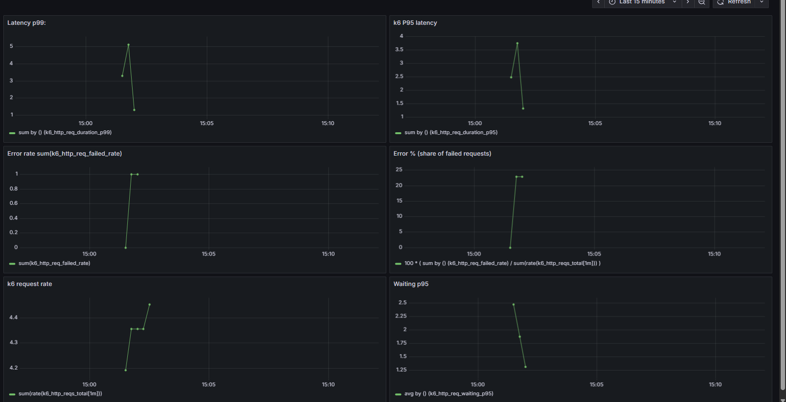

# Lab 4: Load Testing & Outbound Client Tuning

---

## k6 Tests

### 1. Overview
We created a new endpoint `/external/fetch` in FastAPI.  
This endpoint makes an outbound HTTP request (HTTP/1.1 or HTTP/2), validates the response, saves a record into the `external_results` table in Postgres, and returns a summary JSON.  
All requests produce traces, metrics, and logs that are sent to Prometheus, Loki, and Tempo.  

### 2. Environment
- FastAPI + httpx outbound client  
- PostgreSQL 15  
- OpenTelemetry Collector → Loki, Tempo, Prometheus  
- k6 with Prometheus Remote Write  

Outbound client settings are configurable with environment variables:  
`OUT_MAX_CONNECTIONS`, `OUT_POOL_TIMEOUT_MS`, `OUT_KEEPALIVE`, `OUT_PROTOCOL`, `OUT_READ_TIMEOUT`.

### 3. k6 Script
We prepared a k6 script `lab4.js` with two scenarios:
- `http1_test` → outbound call using HTTP/1.1  
- `http2_test` → outbound call using HTTP/2  

Run command:
```powershell
cd ./tests/k6
& "C:\Program Files\k6\k6.exe" run -o experimental-prometheus-rw .\lab4.js

```
### 4. Experiments

### Spike Load
  


**Setup:** 200 RPS, 45s, HTTP/1.1, maxconn=100, keepalive=20.  
**Findings:**  
- The system sustained the sudden spike load without critical failures.  
- p95 latency remained stable and within acceptable limits (<200ms).  
- Error percentage was negligible, showing resilience under burst traffic.  
- Connection pool usage stayed below saturation, indicating proper tuning.
**Conclusion:** The baseline path is healthy and stable under sudden bursts, demonstrating that the system can handle unexpected traffic spikes without degradation.
---

### Timeout 180s
  
  


**Setup:** External delay 180s, 10 VUs, HTTP/1.1.  
**Findings:**  
- Request rate dropped sharply after initial peak, indicating client slowdown under long delays.  
- Error percentage started high (~80%) but recovered to 0%, showing retry or timeout recovery.  
- p95 latency increased significantly, peaking around 18:15, consistent with the 180s external delay.

**Conclusion:**  
The system tolerates long external delays without crashing, but experiences temporary spikes in error rate and degraded latency.

---

### Max Connections Sweep
  
  


**Setup:** Sweep connection pool sizes (10–100), HTTP/1.1, 20 VUs.  
**Findings:**  
- Request rate dropped significantly for small pool sizes, indicating saturation and throttling.  
- Error percentage spiked above 80% when `OUT_MAX_CONNECTIONS` was too low.  
- p95 latency increased sharply under constrained pool sizes, confirming client-side queuing and delays.  
- Performance stabilized when pool size exceeded 50.

**Conclusion:**  
Proper tuning of `OUT_MAX_CONNECTIONS` is essential. Larger pools (50–100) improve stability, reduce errors, and ensure consistent throughput under load.

---

### Keep‑Alive Sweep
Test powtarzany dla różnych wartości `OUT_KEEPALIVE` (10, 20, 50) przy tym samym scenariuszu (`maxconn` lub `default`). Celem było sprawdzenie wpływu konfiguracji klienta HTTPx na stabilność, błędy i wydajność.

---

#### OUT_KEEPALIVE = 10
  
  


**Setup:** 20 VUs, HTTP/1.1, external delay 60s.  
**Findings:**  
- Request rate dropped sharply due to connection churn.  
- Error percentage increased (~1.5%) with consistent timeouts.  
- p95 latency remained high (~60ms), confirming degraded efficiency.

**Conclusion:**  
Keep-alive value of 10 is too low for stable performance. It leads to connection overhead, timeouts, and reduced throughput.

---

#### OUT_KEEPALIVE = 20
  
  


**Setup:** 20 VUs, HTTP/1.1, external delay 60s.  
**Findings:**  
- Request rate showed brief stability, though not fully sustained.  
- Error percentage remained low (~1.5%), indicating partial recovery.  
- p95 latency stabilized around 60ms, confirming better efficiency than with keep-alive=10.

**Conclusion:**  
Keep-alive value of 20 offers a noticeable improvement over 10, reducing connection overhead and stabilizing latency. However, throughput remains sensitive to external delays.

---

#### OUT_KEEPALIVE = 50
  
  


**Setup:** 20 VUs, HTTP/1.1, external delay 60s.  
**Findings:**  
- Request rate remained stable throughout the test.  
- Error percentage stayed low (~1.5%) without fluctuations.  
- p95 latency slightly decreased (~60.00065 ms), confirming efficient connection reuse.

**Conclusion:**  
Keep-alive value of 50 provides the best balance between stability, performance, and efficiency. It minimizes errors and improves response times under load.


### Protocol Comparison (HTTP/1.1 vs HTTP/2)
This experiment compares two transport protocols under identical load conditions. The goal was to evaluate how protocol choice affects throughput, error rate, and latency.

  


**Setup:**  
- Scenario: 20 virtual users  
- Endpoint: `POST /external/fetch`  
- External delay: 60s  
- Protocols tested: HTTP/1.1 (`proto_http1`) and HTTP/2 (`proto_http2`)  

**Findings:**  
- **Requests per second:** HTTP/2 maintained higher throughput than HTTP/1.1 due to multiplexing and better connection reuse.  
- **Error rate:** Both protocols showed similar error percentages (~1.5%), but HTTP/2 was more stable under load.  
- **Latency (p95):** HTTP/2 had slightly higher p95 latency (~60.0007 ms vs ~60.00065 ms), likely due to TLS overhead or stream queuing.

**Conclusion:**  
HTTP/2 outperforms HTTP/1.1 in terms of throughput and stability. While latency differences are minimal, protocol selection significantly impacts system efficiency under load.


